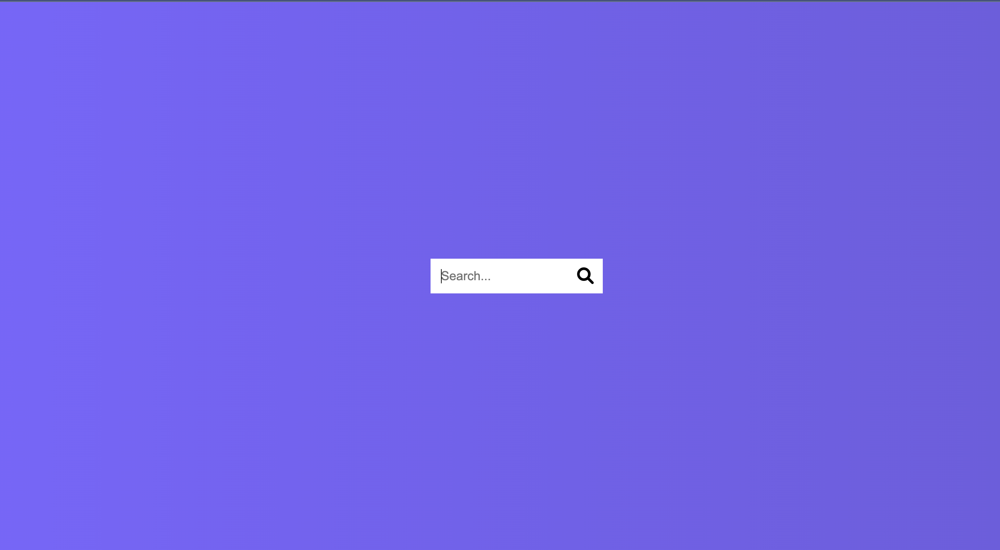

# 50 Projects in 50 Days - Hidden Search Widget

This is a code along project in the [50 Projects In 50 Days - HTML, CSS & JavaScript Udemy Course](https://www.udemy.com/course/50-projects-50-days/). Sharpen your skills by building 50 quick, unique & fun mini projects.

## Table of contents 😌

- [Overview](#overview)
  - [The project](#the-project)
  - [Screenshot](#screenshot)
  - [Links](#links)
- [My process](#my-process)
  - [Built with](#built-with)
  - [What I learned](#what-i-learned)
  - [Continued development](#continued-development)
  - [Useful resources](#useful-resources)
- [Author](#author)
- [Acknowledgments](#acknowledgments)

## Overview👋🏾

Welcome to the fourth mini-project of the course!

### The project😥

In this project users will be able to:

- Build a responsive site that displays hidden search bar.

### Screenshot🌇

### Links👩🏾‍💻

- Solution URL: (https://github.com/MaianneThornton/50in50_HiddenSearchWidget)
- Live Site URL: (https://silly-alfajores-d0d260.netlify.app/)

## My process💭

This is a simple project that I started by marking out initial classes in the html file to be later used for styling. Next I began styling the css by styling the search bar and button. I then added functionality by way of JavaScript to toggle between classes when the user clicks on the button.

### Built with👷🏾‍♀️

- Semantic HTML5 markup
- CSS custom properties
- Flexbox
- JavaScript

### What I learned👩🏾‍🏫

I learned the logic behind making a simple hidden search bar. I will be applying this to future projects where needed.

### Continued development🔮

In the future I plan on continuing to practice positioning elements using flexbox, and using different selectors such as nth of type to select elements.

I also plan on continuing to practice using event listeners to make my pages more functional.

I also plan on continuing to learn the best ways to phrase git commits, so that future viewers can fully understand the changes that have occurred.

### Useful resources📖

- [Resource](https://www.freecodecamp.org/news/how-to-write-better-git-commit-messages/) - This is an amazing article which helped me write better commit messages. I'd recommend it to anyone still learning this concept.

## Author🔎

- Website - [Portfolio Site](https://www.maiannethornton.com/Portfolio/index.html)
- Frontend Mentor - [@MaianneThornton](https://www.frontendmentor.io/profile/MaianneThornton)
- GitHub - [@MaianneThornton](GitHub.com/MaianneThornton)
- Twitter - [@MaianneThornton](https://twitter.com/MaianneThornton)
- LinkedIn - [@MaianneThornton](https://www.linkedin.com/in/maiannethornton/)

## Acknowledgments🙏🏾

Special Thanks go to [Brad Traversy](http://www.traversymedia.com/) and [Florin Pop](http://www.florin-pop.com/) creating the course and making reviewing concepts fun 😊.
